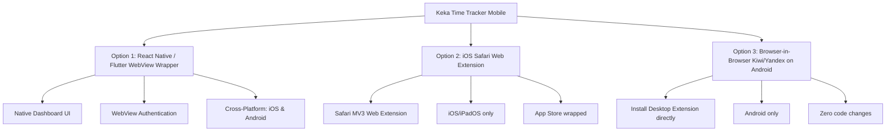
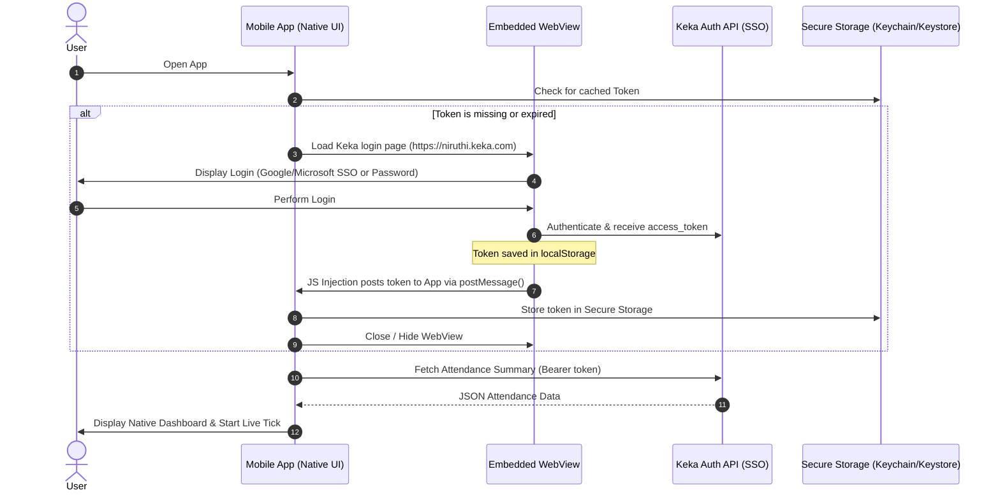

# Mobile Integration Proposal: Keka Time Tracker

This document outlines the architecture, implementation options, technical challenges, and blockers for extending the Keka Time Tracker extension into a mobile application.

---

## 🗺️ High-Level Architecture Options

To port the Keka Time Tracker functionality (extracting the authentication token and fetching/calculating live hours) to mobile devices, we have three primary routes. Each has distinct tradeoffs regarding developer effort, platform support, and user experience.



---

## 📊 Comparison of Approaches

| Criteria | Option 1: Native WebView Wrapper (Recommended) | Option 2: Safari Web Extension | Option 3: Android Alternative Browsers |
| :--- | :--- | :--- | :--- |
| **Platforms** | iOS & Android | iOS & iPadOS only | Android only |
| **User Experience** | **Premium & Native** (Widgets, push notifications, lock screen widgets, sleek native animations) | **Browser-Bound** (User must open Safari, tap extension icon to view data) | **Browser-Bound** (Requires using Kiwi/Yandex instead of default Chrome/Firefox) |
| **Authentication** | Hidden WebView login, then token extraction & local persistence | Auto-extracts from active Safari Keka session | Auto-extracts from active Kiwi Keka session |
| **Development Cost** | Medium (Requires building a mobile app codebase in React Native/Flutter) | Low (Use Apple's extension converter to compile existing code) | Zero (Directly install the current extension from the Chrome Web Store) |
| **App Store Cost** | Apple App Store ($99/yr), Google Play ($25 one-time) | Apple App Store ($99/yr) | Free (User installs third-party browser + extension) |

---

## 🛠️ Option 1 Deep Dive: Native WebView Wrapper (React Native / Expo)

This is the most professional and robust solution for providing a true mobile app experience. It uses an embedded, headless (or visible during login) WebView to intercept the Keka access token and store it securely.

### The Authentication Flow



### Key Implementation Boilerplate (React Native + `react-native-webview`)

Here is the exact code snippet to inject into the Keka WebView to extract the authentication token:

```javascript
import React, { useState, useEffect } from 'react';
import { StyleSheet, View, Text, ActivityIndicator } from 'react-native';
import { WebView } from 'react-native-webview';
import * as SecureStore from 'expo-secure-store';

const KEKA_LOGIN_URL = 'https://niruthi.keka.com/';

export default function KekaAuthScreen({ onAuthSuccess }) {
  const [loading, setLoading] = useState(true);

  // Injected JS that constantly polls localStorage for the access_token
  const tokenExtractionScript = `
    (function() {
      var checkToken = setInterval(function() {
        var token = localStorage.getItem('access_token');
        if (token) {
          clearInterval(checkToken);
          window.ReactNativeWebView.postMessage(JSON.stringify({
            type: 'TOKEN_EXTRACTED',
            token: token
          }));
        }
      }, 1000);
    })();
    true; // Required for WebView evaluation
  `;

  const handleMessage = async (event) => {
    try {
      const data = JSON.parse(event.nativeEvent.data);
      if (data.type === 'TOKEN_EXTRACTED' && data.token) {
        // Save to iOS Keychain / Android KeyStore
        await SecureStore.setItemAsync('keka_access_token', data.token);
        onAuthSuccess(data.token);
      }
    } catch (err) {
      console.error('Failed to parse token message:', err);
    }
  };

  return (
    <View style={styles.container}>
      <WebView
        source={{ uri: KEKA_LOGIN_URL }}
        injectedJavaScript={tokenExtractionScript}
        onMessage={handleMessage}
        onLoadEnd={() => setLoading(false)}
        style={styles.webview}
      />
      {loading && (
        <ActivityIndicator size="large" color="#007aff" style={styles.loader} />
      )}
    </View>
  );
}

const styles = StyleSheet.create({
  container: { flex: 1, backgroundColor: '#fff' },
  webview: { flex: 1 },
  loader: { position: 'absolute', top: '50%', left: '50%', transform: [{ translateX: -25 }, { translateY: -25 }] }
});
```

---

## ⚡ Edge Cases & Handling Strategies

### 1. Token Expiration & Re-authentication
* **The Problem:** Keka access tokens have a limited lifespan. When the token expires, API requests return `401 Unauthorized`.
* **The Solution:** The app must intercept `401` HTTP errors from Keka API calls, clear the expired token from secure storage, and display the WebView modal again so the user can re-authenticate. If session cookies are still valid in the WebView browser context, the user will be logged in automatically without re-entering credentials.

### 2. Enterprise SSO & MFA Redirects
* **The Problem:** Many enterprises protect Keka with Multi-Factor Authentication (MFA) via Microsoft Authenticator or Google Authenticator. In addition, Google/Microsoft SSO often blocks authentication inside "embedded WebViews" (returning a `disallowed_useragent` error).
* **The Solution:**
  1. Set a standard mobile User-Agent string on the WebView to prevent SSO platforms from detecting it as an embedded Webview.
     * Example User-Agent: `Mozilla/5.0 (iPhone; CPU iPhone OS 16_5 like Mac OS X) AppleWebKit/605.1.15 (KHTML, like Gecko) Version/16.5 Mobile/15E148 Safari/604.1`
  2. If conditional access is strictly enforced by corporate IT (requiring MDM or managed browsers like MS Edge), we must use `ASWebAuthenticationSession` (iOS) or `Custom Tabs` (Android). However, because these sessions run in separate sandbox systems, we cannot directly inject JavaScript to read local storage. We would need to intercept the OAuth redirect callback instead, which is difficult without Keka's official client keys.

### 3. Background Services & OS Killing (Battery Optimization)
* **The Problem:** To show live notifications (e.g., "You hit 8h 15m!") or home screen widgets, the app needs to query the Keka API in the background. Android and iOS heavily restrict background network fetches to save battery.
* **The Solution:**
  * **Android:** Create a **Foreground Service** with a persistent notification. This guarantees the Android OS won't kill the background worker, allowing the app to poll Keka's APIs every 15 minutes.
  * **iOS:** iOS strictly limits background fetches using the `BackgroundTasks` framework. The OS determines when to run the task based on user habits (usually once or twice a day). Thus, live background timers are virtually impossible on iOS without a server-side component.
  * **Unified Workaround:** The app can compute the remaining time *locally* once it retrieves the initial punch data. Since we know the punch-in time, we don't need to fetch the Keka API continuously in the background. The app can set a local OS Alarm/Notification scheduled for `Date.now() + remainingTime` from the frontend!

### 4. Direct Clock-in/Clock-out (Punching)
* **The Problem:** If users want to punch in/out directly from the mobile app, Keka's API requires geo-location data or IP address verification depending on company policy.
* **The Solution:** Request mobile Location Permissions (`geolocation`) and pass the latitude/longitude coordinate payloads to the Keka punch endpoint if required by the company's workspace rules.

---

## 🚫 Key Blockers & Corporate Security Risks

> [!WARNING]
> **Enterprise MDM & Conditional Access Policies**
> Many companies require employees to access Keka through a VPN, or restrict access via Microsoft Entra ID / Okta conditional access. If a policy specifies "Approved Client App" or "Intune Managed Device", a custom mobile app will be blocked by the SSO gate. There is no bypass for this other than using official web portals.

> [!IMPORTANT]
> **Undocumented APIs & Fragility**
> The Keka Time Tracker relies on Keka's internal endpoints:
> * `/k/attendance/api/mytime/attendance/summary`
> * `/k/default/api/me/publicprofile`
>
> Because these APIs are undocumented and private, Keka can change their schemas, path prefixes, or authentication headers at any time. When this happens, a mobile app would require an immediate App Store update to avoid crash loops, which takes 24-48 hours for Apple/Google approval.

> [!CAUTION]
> **Corporate IT Compliance & Security Policies**
> Storing company credentials or employee access tokens on personal devices inside a non-approved app can trigger corporate security flags (DLP - Data Loss Prevention). Before sharing the app with coworkers, check if your company's IT policy forbids third-party API clients.

---

## 🚀 Recommended Roadmap

1. **Step 1: Safari Extension for iOS (Quick Win)**
   * Run the Xcode Safari converter on this repository to compile it as an iOS Safari extension. It allows you and your iPhone friends to use the tool in Safari immediately with minimal overhead.
2. **Step 2: Expo / React Native App (Poc)**
   * Create an Expo project using a WebView to capture `access_token`. Show a beautiful dashboard with circular progress rings for Effective and Gross hours, and rebuild the `Catch ⏰` and `Bounce ⏰` mini-games in React Native.
3. **Step 3: Native Home Widgets**
   * Implement iOS WidgetKit and Android AppWidget support. Once the app extracts the token, it updates a tiny widget on the phone's home screen, showing effective hours in real-time.
